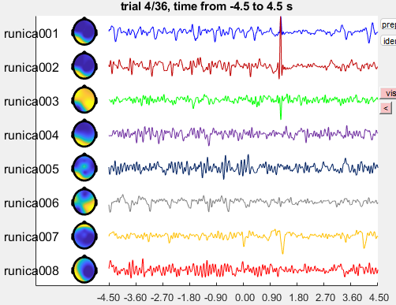

# **DecANatS**: Decoding Action Intentions in Natural Scenes

# Methods
## Procedure

The participant was instructed to walk three times, in clock-wise direction, around a block of offices located at the University of Regensburg. The route was approximately 35 by 55 meters long and was indoors throughout (see Fig. 1). 

**Fig. 1**: Walking route with offline-generated landmarks (credits to Noah).

## Data Acquisition

The EEG data was collected from a mobile 250 Hz, 8-channel EEG amplifier (Cyton Biosensing Board, OpenBCI, New York, USA) that was built into a custom chest strap along with a Raspberry Pi 3b computer, a Google Pixel 9 mobile phone and power supply. The amplifier was connected to lab-grade passive Ag/AgCl ring electrodes that were plugged into an elastic cap (EasyCap, Herrsching-Breitbrunn, Germany) at positions AFz, FCz, C3, C4, CPz, Pz, PO3 and PO4 according to the extended 10-20 system (Oostenveld and Praamstra, 2001). Two additional electrodes at positions Cz and F4 were used as online reference and ground, repectively. The impedances were kept below 20 (?) kOhm. 

During the recording, position data were continuously co-registred with the EEG. Moreover, video and eye-tracking data were registered from a Hololens 2 mixed-reality headset (Microsoft Corporation, Redmond, USA). These data were used for constructing events for the EEG analysis.

## Data Analysis

### Preprocessing
Per participant, the EEG data were converted to BIDS format. As a part of the data transform, position information was read out from the protocol files and used for identifying time points where participants passed relevant landmarks. There were six doors and four corners on the walking route. The first door ("door_0" in Fig. 1) served as a start and end point and was not considered in the analysis. For the other landmarks, the time point where participant entered a radius of 1.5 m around doors, or a radius of 3.5 meters around the apex of a corner, were considered as onsets of "door" and "corner" events for the EEG analysis, respectively. For comparison, three "null" events were constructed, defined as the time points were participants reached half way between doors 1 and 2, doors 2 and 3, and doors 3 and 4.

> *./preproc/convEEG2bids_CCC.m*:  convert csv data file to BIDS for participant CCC

### Assessment of data quality
The data was segmented into epochs from -4.5 to 4.5 s relative to the event onset, filtered between 0.1 and 40 Hz, then demeaned and de-trended. An example EEG epoch is depicted in Figure 2. It shows typical EEG waveforms overall, with three notable findings. First, electrode AFz shows eye blink artefacts. Second, electrode PO3 shows much higher amplitudes than all other electrodes. Third, PO3 and PO4 show a high-amplitude artifact.

**Fig. 2**: A typical EEG epoch with artefact.

 For identifying the source of the high amplitude artifact, the continous EEG data was plotted along with event markers. Figure 3 shows the scaled amplitude at electrode PO3. Red dots mark the onset of each data segment, i.e., a start a new recording. Blue dots show the event onsets for corners, black dots for doors. It is evident that the high-amplitude artefact occurs whenever a new segment starts, or when the participant passes a door. 

**Fig. 3**: Continous EEG at electrode PO3 and event markers (red: segment, black: doors, blue: corners). High amplitude artefacts occurred for the onsets of new segments, and for the event 'doors'.

 
 For addressing the artefact at electrode AFz, an infomax ICA was computed with the EEG data filtered between 1 and 15 Hz (Fig. 3). Independet component 7 shows a clear eye blink topography and waveform that matched with the EEG waveform at AFz. 

**Fig. 2**: A typical EEG epoch with artefact.

[//]: # (Because there were only a few trials and
 electrodes, conventional artifact removal routines that target full epochs and ICA components were not applicable. An automatic artefact removal algorithm was used instead, ATAR, Bajaj et al. 2020. Visual inspection showed 
 frequent but short-lasting artifacts specifically at electrodes PO3 and PO4. These were removed after applying ATAR.)

[//]: # (This is a comment)
[//]: # (AFz   19    N1P)
[//]: # (FCz    1    N2P)
[//]: # (C3    16    N3P)
[//]: # (C4    10    N4P)
[//]: # (CPz    4    N5P)
[//]: # (Pz    13    N6P)
[//]: # (PO3   28    N7P)
[//]: # (PO4   25    N8P)
[//]: # (Cz    REF   SRB2 REF, weiß)
[//]: # (F4    21    BIAS GND, Schwarz)

## Analysis
### Preprocessing
