# **DecANatS**: Decoding Action Intentions in Natural Scenes

# Methods
## Procedure

The participant was instructed to walk three times, in clock-wise direction, around a block of offices located at the University of Regensburg. The route was approximately 35 by 55 meters long and was indoors throughout (see Fig. 1). 

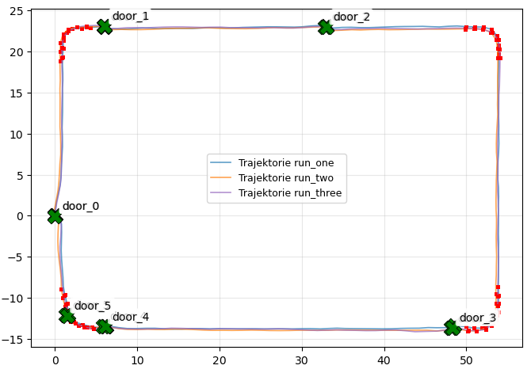
**Fig. 1**: Walking route with offline-generated landmarks (credits to Noah).

## Data Acquisition

The EEG data was collected from a mobile 250 Hz, 8-channel EEG amplifier (Cyton Biosensing Board, OpenBCI, New York, USA) that was built into a custom chest strap along with a Raspberry Pi 3b computer, a Google Pixel 9 mobile phone and power supply. The amplifier was connected to lab-grade passive Ag/AgCl ring electrodes that were plugged into an elastic cap (EasyCap, Herrsching-Breitbrunn, Germany) at positions AFz, FCz, C3, C4, CPz, Pz, PO3 and PO4 according to the extended 10-20 system (Oostenveld and Praamstra, 2001). Two additional electrodes at positions Cz and F4 were used as online reference and ground, repectively. The impedances were kept below 20 (?) kOhm. 

During the recording, position data were continuously co-registred with the EEG. Moreover, video and eye-tracking data were registered from a Hololens 2 mixed-reality headset (Microsoft Corporation, Redmond, USA). These data were used for constructing events for the EEG analysis.

## Data Analysis

### Preprocessing
Per participant, the EEG data were converted to BIDS format. As a part of the data transform, position information was read out from the protocol files and used for identifying time points where participants passed relevant landmarks. There were six doors and four corners on the walking route. The first door ("door_0" in Fig. 1) served as a start and end point and was not considered in the analysis. For the other landmarks, the time point where participant entered a radius of 1.5 m around doors, or a radius of 3.5 meters around the apex of a corner, were considered as onsets of "door" and "corner" events for the EEG analysis, respectively. For comparison, three "null" events were constructed, defined as the time points were participants reached half way between doors 1 and 2, doors 2 and 3, and doors 3 and 4.

> *./preproc/convEEG2bids_CCC.m*:  convert csv data file to BIDS for participant CCC

### Assessment of data quality
The data was segmented into epochs from -4.5 to 4.5 s relative to the event onset, filtered between 0.1 and 40 Hz, then demeaned and de-trended. An example EEG epoch is depicted in Figure 2. It shows typical EEG waveforms overall, with three notable findings. First, electrode AFz shows eye blink artefacts. Second, electrode PO3 shows much higher amplitudes than all other electrodes. Third, PO3 and PO4 show a high-amplitude artifact.

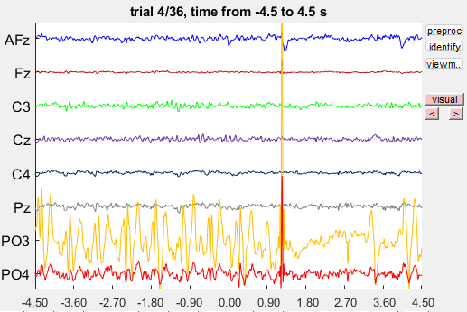
**Fig. 2**: A typical EEG epoch with artefact.

 For identifying the source of the high amplitude artifact, the continous EEG data was plotted along with event markers. Figure 3 shows the scaled amplitude at electrode PO3. Red dots mark the onset of each data segment, i.e., a start a new recording. Blue dots show the event onsets for corners, black dots for doors. It is evident that the high-amplitude artefact occurs whenever a new segment starts, or when the participant passes a door. 

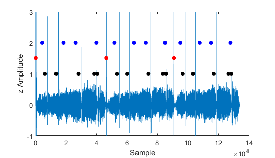
**Fig. 3**: Continous EEG at electrode PO3 and event markers (red: segment, black: doors, blue: corners). High amplitude artefacts occurred for the onsets of new segments, and for the event 'doors'.

 
 For addressing the *eye blink artefact* at electrode AFz, an infomax ICA was computed with the EEG data filtered between 1 and 15 Hz (Fig. 3). One independet component showed a clear eye blink topography and waveform that matched with the EEG waveform at AFz. This component was removed from the data.

Trials with *movement artifacts* like that depicted in Fig. 2 (~ 1s) would be removed from the data in a conventional pre-processing routine. However, since we have only a limited number of trials, we can possibly not afford to remove whole trials. Instead the movement artefacts were addressed with the following three approaches:
- **Denoising Source Separation (DSS)**. This is a blind source separation technique that, like the ICA,  unmixes a signal into components. DSS, however, can identify signal components that are time-locked to user-defined events. For our data, peak artifact time points +- 0.5 s were used as events. DSS identified two components whose topography and waveform matched the artifacts at electrodes PO3 and PO4. These were removed from the data. The outcome is shown in Figures 4 (all electrodes) and 5 (electrodes AFz and PO3, overlay pre /post cleaning).

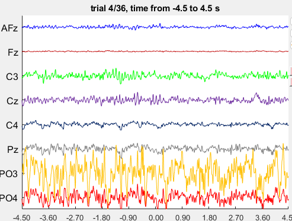
**Fig. 4**: Typical EEG epoch after artifact correction with ICA and DSS. Compare with the uncleaned data depicted in Fig. 2. 

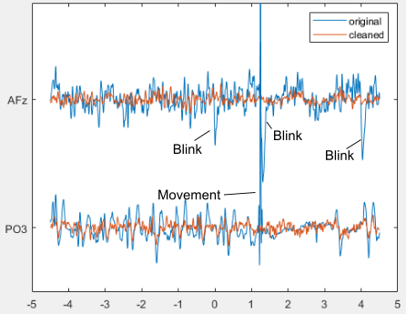
**Fig. 5**: Overlay of EEG waveforms shown in Figs. 2 and 4 for electrodes with the strongest movement artefacts. 

- **Automatic and Tunable Artifact Removal (ATAR)**. This is an algorithm for artifact removal that relies on wavelet package decomposition. Wavelet coefficients with a high variance are considered artifacts and the corresponding frequency components are attentuated. Different from ICA and DSS, which require multiple trials with artifacts for learning, ATAR works with single trials and also  with single channels. The method can therefore be used for artifact correction in an ongoing EEG, which makes it interesting for BCI applictions. ATAR was applied with the method 'soft thresholding' and the aggressiveness parameter beta was set to 1. Results are depicted in Figs. 6 and 7.
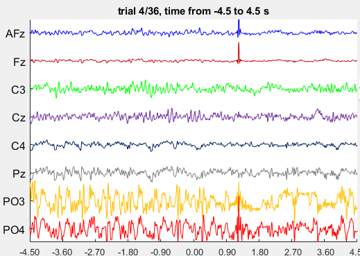
**Fig. 6**: Typical EEG epoch after artifact correction with ICA and ATAR. Compare with the uncleaned data depicted in Fig. 2, and DSS-cleaned data in Fig. 4. 

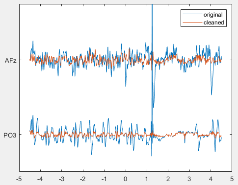
**Fig. 7**: Overlay of EEG waveforms shown in Figs. 2 and 6 for electrodes with the strongest movement artefacts. 

- **Partial rejection**. Finally, a data set was constructed where time points with movement artefacts were overwritten with NaN values.

When considerung Fig. 2, one obvious feature is the very high amplitude at electrode PO3 (and, compared to the more frontal electrodes, also electrode PO4). My suspicion is that these are artifacts originating from walking.  The data depicted in Fig. 8 confirm this assumption. Sub-plots 1-3 show that waveforms recorded at posterior electrodes, but not AFz, have a spectral peak around 1.6 Hz (3.2, 4.8 Hz) that is typical for one gait cycle. Sub-plot 4 shows the band-pass filtered waveform (1-2 Hz) at both posterior electrodes. The amplitude has the same phase at left and right electrodes, and becomes smaller as the participant is near a door (t=0), likely showing that she was slowing down or stopping.

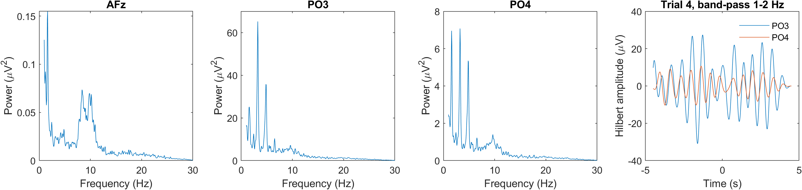
**Fig. 8**: Power spectra and Hilbert amplitude of band-pass filtered waveform (1-2 Hz) at selected electrodes. The data suggest that large amplitude artefacts at posterior electrodes originate from the gait cycle.

Overall, ICA + DSS showed the best performance for reducing eye blink and movement artefacts. ATAR worked well for eye blink artifacts and the movement artefact at PO3, but produced an artefact at frontal electrodes during signal reconstruction. Further tuning of the ATAR parameters might lead to better outcomes, if this should be of interest. Partial rejection is the most conservative method where the artifact but other signal components are removed. Some analyses might be not be working with NaNs in time series. With respect to the gait cycle artifact, I suggest using only frequencies of 5 Hz and higher for the classification.

After cleaning for artifacts, the data was re-referenced using the  reference electrode standardization technique (REST). The technique bases on a forward model, which was computed from on a three-layer spherical headmodel. 

## To do for preprocessing (by Tuesday)
- check spectrogram of PO electrodes. Notch filter possible? [done]
- re-reference without bringing noise from PO electrodes into frontal electrodes (try REST) [done]
- 

[//]: # (This is a comment)
[//]: # (AFz   19    N1P)
[//]: # (FCz    1    N2P)
[//]: # (C3    16    N3P)
[//]: # (C4    10    N4P)
[//]: # (CPz    4    N5P)
[//]: # (Pz    13    N6P)
[//]: # (PO3   28    N7P)
[//]: # (PO4   25    N8P)
[//]: # (Cz    REF   SRB2 REF, weiß)
[//]: # (F4    21    BIAS GND, Schwarz)

## Analysis
### Preprocessing

### Classification
The data was decomposed into frequencies from 4 to 30 Hz, in steps of 12 ms, and baseline-corrected using post-event time bins from 3 to 3.6 s. The baseline correction transformed the data from raw power to relative change in power with respect to the baseline.
The data was then subjected into a binary classifier using electrodes as features, and time and frequency as search dimensions (LDA, 5-fold cross validation). Results are depicted in Figure 9 and Figure 10. Notable time and frequency ranges with high accuracy occurred around 8-10 Hz, -0.5 to 0 s; and between 25 and 30 Hz throughout the pre-stimulus part of the epoch. A topography for the 8-10 Hz frequencies showed that the accuracy was maximal at electrode Cz. The frequency range and topography suggest that this is a mu rhythm which is typically observed during motor action.

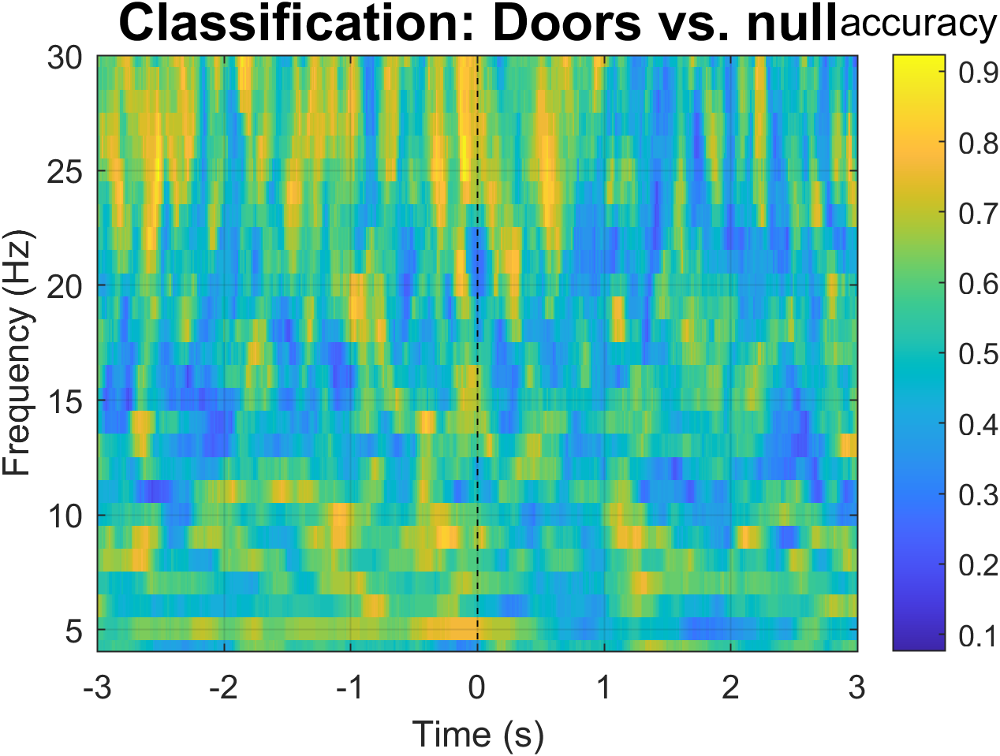
**Fig. 9**: Classification accuracy for 'doors' versus null events. The data was the change in power relative to a 3 to 3.6 s post-event baseline.

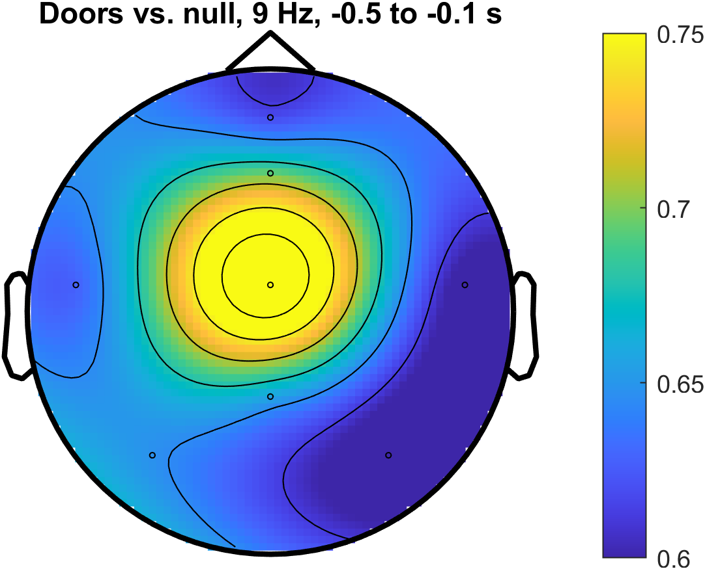
**Fig. 10**: Topography for the 9 Hz pre-stimulus accuracy as seen in Fig. 9.

The same analysis was used for classification of corners versus null events. The results were comparable to those reported for doors (Figs. 11 and 12). Again, the maximum accuracy was found at electrode Cz. Compared to classification of doors, accuracies were also comparably high for electrodes AFz, Fz and C3.

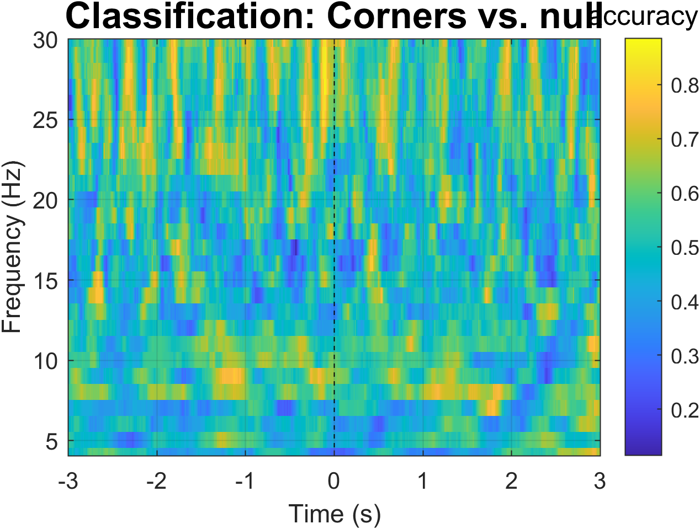
**Fig. 11**: Same as Fig. 9, but for classification of corners vs. null events.

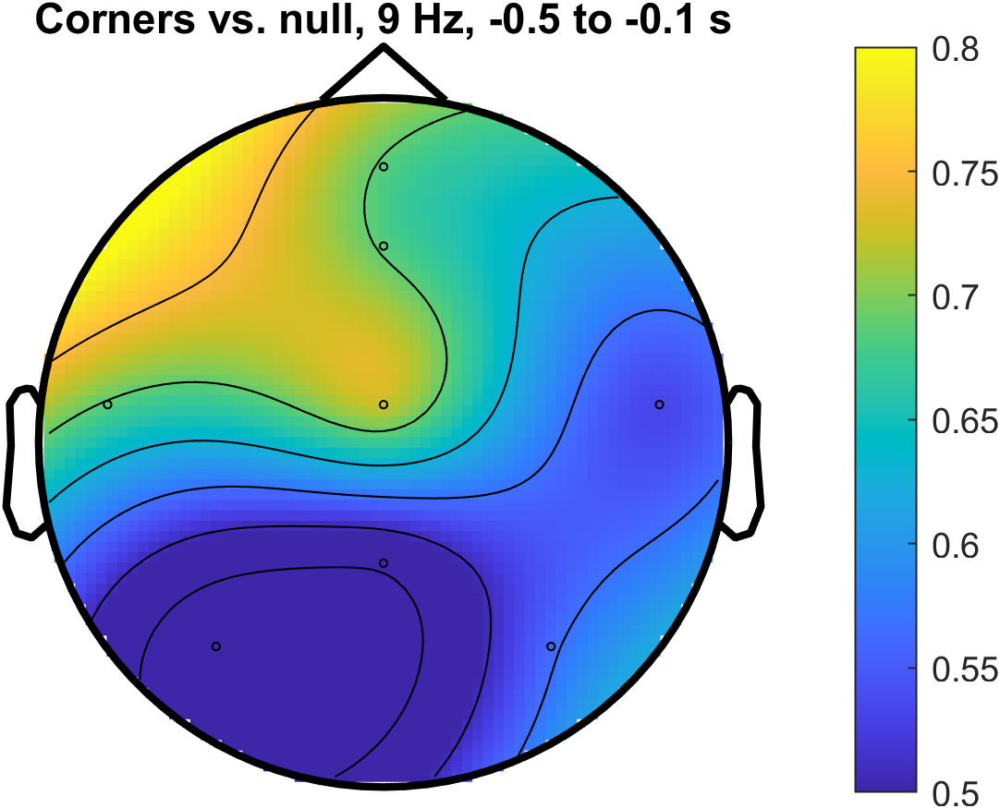
**Fig. 12**: Same as Fig. 10, but for classification of corners vs. null events.

Next steps:
- pre-process continuous (rather than epoched) data, so that the classifier can be applied to moving windows along the walking path
- try EEGnet, https://github.com/vlawhern/arl-eegmodels

[//]: # (try EEGNet, Thursday)

